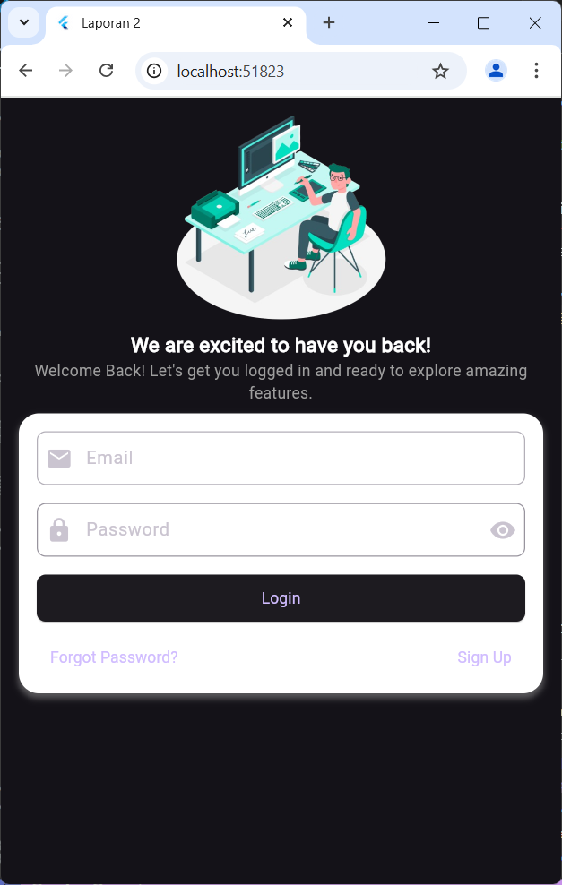
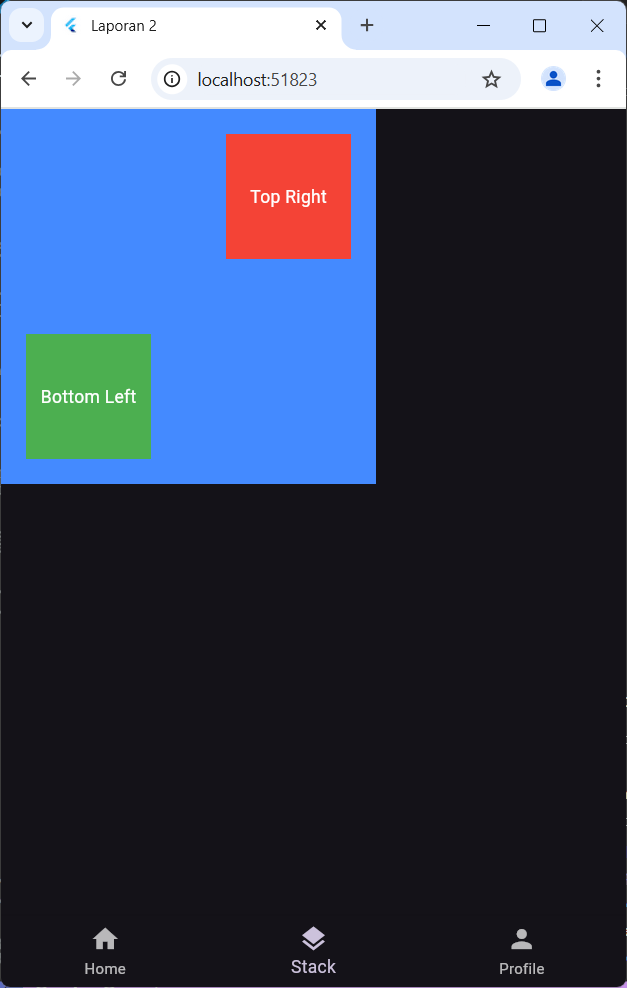
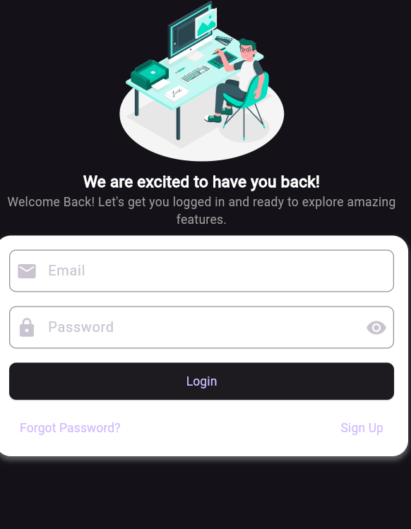

# 📘 Bahan Praktikum Laporan 2 - Mobile Development

Laporan ini mencakup berbagai konsep dasar dalam pengembangan aplikasi mobile menggunakan Flutter, termasuk pembuatan tampilan login serta pemahaman tentang **Stack, Row, dan Column Widget**. Selain itu, kita juga akan membahas konfigurasi dasar pada **pubspec.yaml**.

---

## 🔹 Point Pembelajaran

✅ **Login View** – Membuat tampilan login yang menarik dan responsif.  
✅ **Stack Widget** – Memahami cara menumpuk elemen dalam Flutter.  
✅ **Row Widget** – Mengatur elemen dalam tata letak horizontal.  
✅ **Column Widget** – Menyusun elemen secara vertikal.  
✅ **pubspec.yaml** – Mengelola dependensi dan aset dalam proyek Flutter.

---

## 🔑 Login View

Tampilan login yang dibuat memiliki desain modern dengan elemen UI yang intuitif. Berikut adalah contoh tampilannya:

📌 **Referensi Desain:**

- [Freepik - Designer Concept Illustration](https://www.freepik.com/free-vector/designer-concept-illustration_6170426.htm#fromView=keyword&page=1&position=2&uuid=b5fce5ab-394f-4433-9768-d95db6a09b5b&query=Illustrator)
- [remove.bg - Menghapus Background Gambar](https://www.remove.bg/)

---

## 🎯 Stack Widget

Widget **Stack** memungkinkan kita menempatkan beberapa elemen secara bertumpuk satu sama lain. Ini sering digunakan untuk overlay gambar, ikon, atau elemen UI lainnya.

**Contoh Implementasi Stack Widget:**

📌 **Referensi Lebih Lanjut:**  
[Dokumentasi Resmi Flutter - Stack Widget](https://api.flutter.dev/flutter/widgets/Stack-class.html)

---

## 📏 Row Widget

Widget **Row** digunakan untuk menyusun elemen secara horizontal dalam satu baris. Cocok untuk layout menu, tombol navigasi, atau daftar item.

**Contoh Implementasi Row Widget:**

📌 **Referensi Lebih Lanjut:**  
[FlutterFlow - Row & Column Widget](https://docs.flutterflow.io/resources/ui/widgets/composing-widgets/rows-column-stack/)

---

## 📐 Column Widget

Widget **Column** memungkinkan kita menyusun elemen secara vertikal. Digunakan untuk membuat daftar, formulir login, atau tata letak berbasis blok.

**Contoh Implementasi Column Widget:**

📌 **Referensi Lebih Lanjut:**  
[FlutterFlow - Column Widget & Alignment](https://docs.flutterflow.io/resources/ui/widgets/composing-widgets/rows-column-stack/#common-property-alignment)

---

Dengan memahami widget ini, kita dapat membangun antarmuka yang lebih dinamis dan responsif dalam aplikasi Flutter. 🚀
